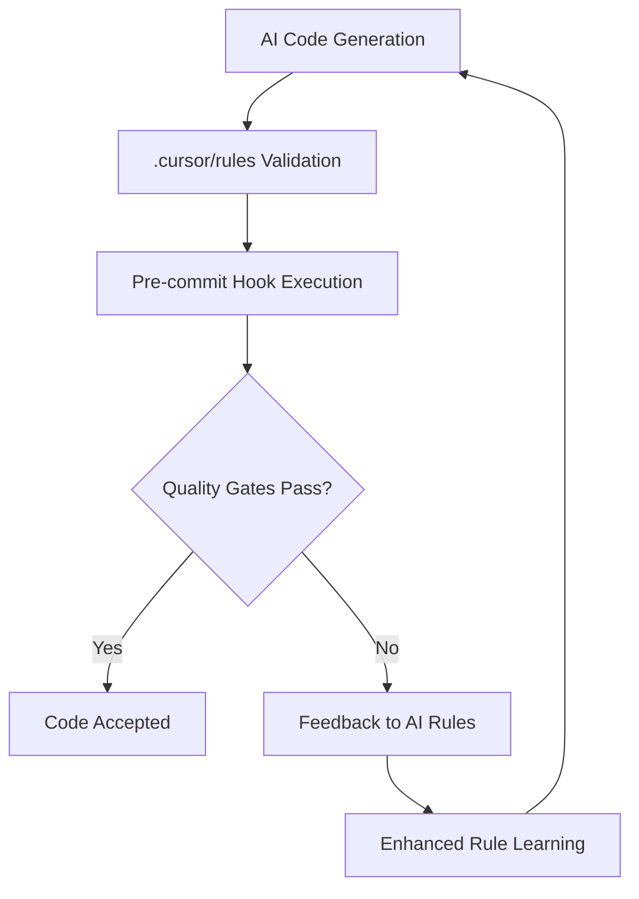

# 🤖 Cursor AI & Quality Gates Integration

**Enterprise-Grade AI Development with Automated Quality Enforcement**

> **🎯 Overview**: Complete integration between Cursor AI editor and NixOS quality gates system, ensuring AI-generated code meets enterprise standards automatically.

## 🏗️ **Architecture Overview**

### **Three-Layer Integration System**

```
┌─────────────────────────────────────────────────────────────┐
│                    Cursor AI Editor                         │
│  ┌─────────────────┐  ┌─────────────────┐  ┌─────────────────┐ │
│  │  .cursor/rules  │  │   Agent Mode    │  │  Background AI  │ │
│  │   (MDC Format)  │  │   (Ctrl+I)      │  │   (Ctrl+E)      │ │
│  └─────────────────┘  └─────────────────┘  └─────────────────┘ │
└─────────────────────────────────────────────────────────────┘
                                │
                    ┌───────────┴───────────┐
                    │   Quality Gates       │
                    │   Integration Layer   │
                    └───────────┬───────────┘
                                │
┌─────────────────────────────────────────────────────────────┐
│                 NixOS Development Environment               │
│  ┌─────────────────┐  ┌─────────────────┐  ┌─────────────────┐ │
│  │   Pre-commit    │  │     DevEnv      │  │  System Tools   │ │
│  │     Hooks       │  │   (per-project) │  │  (universal)    │ │
│  └─────────────────┘  └─────────────────┘  └─────────────────┘ │
└─────────────────────────────────────────────────────────────┘
```

## 🎯 **Quality Gates & AI Rules Synchronization**

### **Core Quality Standards**
All AI-generated code automatically enforces:

| **Quality Metric** | **Threshold** | **Enforcement Method** | **AI Rule Integration** |
|-------------------|---------------|----------------------|-------------------------|
| **Cyclomatic Complexity** | CCN < 10 | Lizard (system-wide) | Rules specify patterns to avoid complex nested logic |
| **Code Duplication** | < 5% | JSCPD (system-wide) | Rules encourage abstraction and reusable patterns |
| **Security Patterns** | Zero violations | Semgrep (DevEnv) | Security rules prevent credential exposure, injection flaws |
| **Code Coverage** | > 75% | Project-specific | Testing rules ensure comprehensive test generation |
| **Code Formatting** | 100% compliance | Prettier, ESLint, Black, Ruff | Rules match formatting standards in generated code |

### **Real-Time Quality Feedback Loop**



## 📋 **Cursor Rules System (MDC Format)**

### **Rule File Structure**
```
.cursor/rules/
├── index.mdc           # Core development standards
├── security.mdc        # Security-focused patterns
├── testing.mdc         # Test coverage and quality
└── project-name.mdc    # Project-specific rules
```

### **MDC Format Specification**
```markdown
---
description: Rule description
globs:
  - "**/*.ts"
  - "**/*.tsx"
  - "**/*.py"
alwaysApply: true
---

# Rule Content
AI behavior guidelines and quality standards...
```

## 🔧 **Implementation Levels**

### **1. System-Level Integration (NixOS)**

**Location**: `/home/guyfawkes/nixos-config/modules/home-manager/cursor-enhanced.nix`

```nix
programs.cursor = {
  enable = true;
  # Enterprise-grade settings
  settings = {
    "cursor.yolo" = true;              # Advanced AI capabilities
    "cursor.model" = "claude-3.5-sonnet"; # Primary model
    "cursor.privacyMode" = "enterprise";   # Security mode
  };
};
```

**Features:**
- ✅ Universal Cursor configuration across all projects
- ✅ Enterprise privacy and security settings
- ✅ Model preferences and capabilities
- ✅ Integration with NixOS rebuild process

### **2. Template-Level Integration (DevEnv)**

**Location**: `/home/guyfawkes/nixos-config/templates/ai-quality-devenv/`

```bash
# Automated setup script
setup-cursor() {
  mkdir -p .cursor/rules
  cp -r ~/.config/cursor-templates/rules/* .cursor/rules/
  echo "✅ Cursor AI rules configured with quality gates"
}
```

**Features:**
- ✅ Instant project setup with quality-integrated rules
- ✅ Pre-configured `.cursorignore` for optimal context
- ✅ Quality gate enforcement via pre-commit hooks
- ✅ Project-specific customization templates

### **3. Project-Level Integration (Per-Project)**

**Example**: `/home/guyfawkes/account-harmony-ai-37599577/.cursor/rules/`

```markdown
# account-harmony.mdc
## Quality Standards Integration
- All generated code must pass gitleaks, semgrep, eslint, ruff
- Maintain cyclomatic complexity below 10
- Generate comprehensive tests for new functionality
- Follow existing TypeScript patterns and React component structure
```

**Features:**
- ✅ Technology stack awareness (React, TypeScript, Python, Supabase)
- ✅ Existing code pattern recognition
- ✅ Quality threshold enforcement
- ✅ Security and compliance integration

## 🚀 **Workflow Integration**

### **Development Workflow with AI Quality Gates**

```bash
# 1. Enter development environment
devenv shell

# 2. Open project in Cursor
cursor .

# 3. AI-assisted development with quality enforcement
# Ctrl+I → Agent Mode for complex features
# Ctrl+E → Background suggestions

# 4. Automatic quality validation
git add .
git commit -m "feat: implement feature"
# → Pre-commit hooks run automatically
# → AI-generated code passes all quality gates
```

### **Quality Gate Execution Flow**

```bash
# Pre-commit hooks run in sequence:
1. gitleaks      # ✅ Secret detection
2. prettier      # ✅ Code formatting
3. eslint        # ✅ JavaScript/TypeScript linting
4. black         # ✅ Python formatting
5. ruff          # ✅ Python linting
6. semgrep       # ✅ Security pattern analysis
7. commitizen    # ✅ Conventional commit format

# Post-commit validation (optional):
lizard           # Complexity analysis (system-wide)
jscpd            # Clone detection (system-wide)
```

## 🎯 **AI Behavior Configuration**

### **Core Development Rules (`index.mdc`)**

```markdown
## Code Quality Standards
- Keep cyclomatic complexity below 10 per function
- Maximum function length: 50 lines
- Avoid code duplication above 5% threshold
- Use meaningful variable and function names

## Security First
- Never commit secrets, API keys, or credentials
- Always validate input data
- Use proper error handling with specific error types
- Follow principle of least privilege

## Testing Requirements
- Write tests for all new functionality
- Maintain minimum 75% code coverage
- Use test-driven development when possible
- Include both unit and integration tests
```

### **Security Rules (`security.mdc`)**

```markdown
## Credential Protection
- Use environment variables for all secrets
- Never log sensitive information
- Implement proper input validation
- Use secure error messages without information leakage

## Authentication Patterns
- Follow project's authentication flow (e.g., Supabase Auth)
- Implement proper session management
- Use secure password handling
- Validate user permissions
```

### **Project-Specific Rules**

```markdown
## Technology Stack Integration
- Frontend: React + TypeScript + Vite + Tailwind + shadcn/ui
- Backend: Python 3.13 + FastAPI + Supabase
- Database: Supabase (PostgreSQL)
- Testing: Vitest (frontend) + Playwright (E2E) + pytest (backend)

## Code Generation Guidelines
- Generate code that follows existing patterns and conventions
- Ensure all generated code passes quality gates
- Include proper error handling and loading states
- Write tests for new functionality
```

## 📊 **Quality Metrics & Monitoring**

### **Automated Quality Tracking**

| **Metric** | **Target** | **Monitoring** | **AI Integration** |
|------------|------------|---------------|-------------------|
| **Code Coverage** | > 75% | Project test reports | Testing rules ensure comprehensive coverage |
| **Security Score** | Zero high-severity | Semgrep analysis | Security rules prevent common vulnerabilities |
| **Complexity Score** | CCN < 10 | Lizard analysis | Core rules enforce simple, readable patterns |
| **Duplication** | < 5% | JSCPD detection | Rules encourage abstraction and reuse |
| **Format Compliance** | 100% | Prettier/ESLint/Black/Ruff | Rules match project formatting standards |

### **Quality Report Generation**

```bash
# Comprehensive quality analysis
quality-report

# Output example:
✅ Security: 0 issues found (gitleaks, semgrep)
✅ Formatting: All files compliant (prettier, black)
✅ Linting: 0 issues (eslint, ruff)
✅ Complexity: Average CCN 4.2 (target: <10)
✅ Coverage: 82% (target: >75%)
⚠️  Duplication: 3.1% (target: <5%)
```

## 🔄 **Continuous Improvement Loop**

### **AI Rule Evolution Process**

1. **Quality Gate Feedback**: Failed checks inform rule improvements
2. **Pattern Recognition**: Common issues become new rule patterns
3. **Rule Refinement**: Successful patterns strengthen existing rules
4. **Cross-Project Learning**: Rules evolve across multiple projects

### **Example Evolution**

```markdown
# Initial Rule
"Use proper error handling"

# After Learning
"Implement error boundaries for React components with user-friendly messages,
log errors for debugging without exposing sensitive information,
handle network failures gracefully with retry mechanisms"
```

## 🛠️ **Troubleshooting & Optimization**

### **Common Issues & Solutions**

#### **AI Not Following Quality Standards**
```bash
# Diagnose
1. Check .cursor/rules/ directory exists
2. Verify rule files are in MDC format
3. Restart Cursor to reload rules

# Fix
setup-cursor  # Regenerate rules
```

#### **Quality Gates Failing on AI Code**
```bash
# Diagnose
quality-check  # See specific failures

# Common fixes
1. Update rules to match current quality standards
2. Ensure AI understands project-specific patterns
3. Add examples to rule files
```

#### **Performance Issues**
```bash
# Optimize context
1. Update .cursorignore to exclude unnecessary files
2. Keep rule files focused and concise
3. Use specific globs in rule definitions
```

### **Performance Optimization Tips**

1. **Context Management**: Proper `.cursorignore` configuration
2. **Rule Specificity**: Targeted rules for file types and patterns
3. **Quality Gate Efficiency**: Fast, incremental checks
4. **Model Selection**: Optimal model for task complexity

## 📚 **Resources & Documentation**

### **Configuration Files**
- **System Config**: `nixos-config/modules/home-manager/cursor-enhanced.nix`
- **Template Config**: `nixos-config/templates/ai-quality-devenv/.cursor/`
- **Project Config**: `<project>/.cursor/rules/`

### **Quality Tools Documentation**
- **Gitleaks**: [Secret detection patterns](https://github.com/gitleaks/gitleaks)
- **Semgrep**: [Security rules](https://semgrep.dev/docs/)
- **Lizard**: [Complexity analysis](http://www.lizard.ws/)
- **JSCPD**: [Clone detection](https://github.com/kucherenko/jscpd)

### **Best Practices Guides**
- **Cursor Rules**: [MDC Format Specification](https://docs.cursor.com/rules)
- **Quality Gates**: [Enterprise Development Standards](../devenv.nix)
- **AI Development**: [Project-Specific Patterns](./account-harmony.mdc)

---

## 🎯 **Quick Start Checklist**

- [ ] **System Level**: Cursor configured in NixOS home-manager
- [ ] **Template Level**: AI Quality DevEnv template available
- [ ] **Project Level**: `.cursor/rules/` directory with MDC files
- [ ] **Quality Gates**: Pre-commit hooks configured and working
- [ ] **Testing**: Quality report shows all metrics passing
- [ ] **Integration**: AI-generated code passes all quality checks

**Result**: Enterprise-grade AI development with automatic quality enforcement, ensuring consistent, secure, and maintainable code across all projects.

---

*This document is part of the NixOS AI Quality DevEnv system and is automatically updated as the integration evolves.*